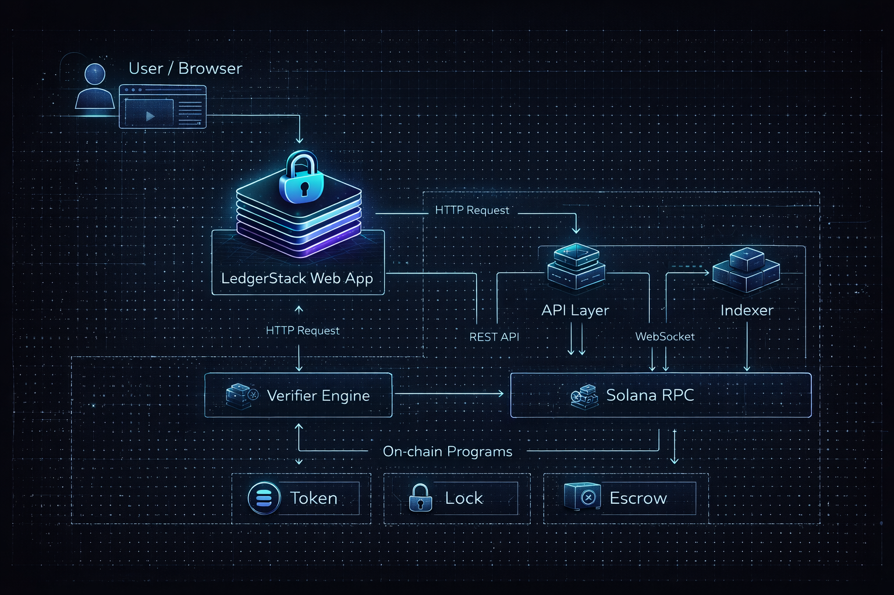

# LedgerStack

<div align="center">
  
</div>

## Philosophy: Trust the Ledger, Not the Claim

Developer announcements carry no weight. Screenshots of locked tokens are trivial to fabricate. Telegram messages about renounced contracts are meaningless. Social promises dissolve under scrutiny.

What remains is the ledger.

LedgerStack is a deterministic verification system for Solana and pump.fun token locks. It reads on-chain state to determine whether a developer has genuinely relinquished control of their token supply, or whether control mechanisms remain active despite public claims to the contrary.

**A ledger, in this context, is a complete record of token ownership, allocation, and control authority derived directly from blockchain state.**

The system does not predict behavior. It does not score trustworthiness. It does not interpret social signals. It resolves a single question: *Can the developer move these tokens?*

If the answer is yes, the lock is invalid. If the answer is no, the lock is verified. If the answer is conditional on admin keys or upgrade authority, the lock is present but compromised.

### Why Developer Claims Are Unreliable

Claims exist in a social layer disconnected from execution. A developer may sincerely believe they have locked their tokens while retaining upgrade authority on the lock contract itself. They may announce a burn while maintaining emergency withdrawal privileges. They may renounce ownership of a proxy contract while controlling the implementation.

These are not lies in the traditional sense. They are failures of technical comprehension, often compounded by tooling that obscures control relationships.

LedgerStack eliminates this ambiguity by ignoring claims entirely.

### Why Screenshots and Announcements Are Insufficient

Screenshots capture visual state at a moment in time. They do not capture authority relationships, hidden admin keys, or programmable unlock conditions. A screenshot showing 100 million tokens in a lock contract reveals nothing about whether the lock contract permits early withdrawal, whether the contract is upgradeable, or whether the developer retains a backdoor through a linked program.

Announcements suffer from the same deficiency. Saying "tokens are locked" is not equivalent to demonstrating that no signature can move those tokens. The gap between statement and reality is where verification systems must operate.

### Why Only On-Chain Control Matters

In a programmable blockchain environment, control is defined by the set of valid state transitions. If a developer's keypair can sign a transaction that results in token movement, the tokens are not locked, regardless of stated intention.

LedgerStack models control as a graph problem. It traces all paths from token holdings to potential withdrawal instructions, evaluating each path for the presence of developer-controlled signing authority. If any path exists, the verdict is negative. If no path exists, the verdict is positive. If paths exist but are gated by conditions the developer does not currently control, the verdict is conditional.

This is not subjective. It is a deterministic evaluation of program state.

---

## System Architecture



LedgerStack is designed as a multi-tier verification pipeline with strict separation between data ingestion, analysis, and presentation layers. The architecture prioritizes reproducibility and auditability over speed.

The system consists of five primary components:

- **Web Interface**: A read-only frontend for querying verification results and rendering Dev Ledger reports. The interface does not perform analysis. It retrieves pre-computed results from the API layer.

- **API Layer**: A stateless service that handles requests, validates inputs, and coordinates verification jobs. The API does not maintain long-lived state. Each request is resolved by invoking the verifier with the requested token address.

- **Verifier Core**: The deterministic analysis engine. Given a token mint address, the verifier reconstructs the complete allocation history, identifies lock contracts, evaluates control authorities, and produces a verdict. The verifier operates exclusively on data retrieved from the indexer and RPC layers.

- **Indexer**: A specialized process that monitors Solana and pump.fun program activity, extracting token creation events, transfer instructions, and program interactions. The indexer maintains a normalized database of token metadata, holder distributions, and historical lock contract deployments.

- **Solana RPC**: The source of truth for all on-chain state. LedgerStack queries RPC nodes directly to retrieve account data, program state, and transaction history. No trusted intermediaries exist between the verifier and the chain.

### Why This Design Matters

The separation between indexer and verifier ensures that verification results are reproducible. Given the same on-chain state, the verifier will always produce the same verdict. This property is critical for auditability. If a dispute arises about a token's lock status, any party can re-run the verifier against the same block height and confirm the result independently.

No off-chain oracles are involved. No reputation systems are consulted. No social graphs are traversed. The system reads program state and applies formal rules.

---

## From Claim to Ledger


Verification begins when a user submits a token mint address. The system does not require the user to specify the developer wallet, the lock contract address, or any metadata about the token. These are derived automatically.

### Step 1: Developer Wallet Identification

The verifier retrieves the token's mint authority and initial supply allocation. For pump.fun tokens, the developer wallet is typically the account that funded the bonding curve deployment. For standard SPL tokens, the developer wallet is identified as the account holding mint authority at creation time or the largest initial recipient of minted supply.

If the mint authority has been revoked and no clear developer wallet can be identified from creation history, the system flags this as an edge case and proceeds with analyzing the largest holder accounts.

### Step 2: Allocation Tracing

The verifier constructs a complete transfer graph starting from the developer wallet. Every outbound transfer is logged. Every recipient account is categorized as either a liquidity pool, a lock contract, a burn address, or a standard wallet.

Transfers to burn addresses (accounts with no signing authority and no program ownership) are considered permanent reductions in circulating supply. Transfers to lock contracts are flagged for deeper analysis.

### Step 3: Lock Contract Detection

Lock contracts are identified by program ownership and instruction set analysis. The verifier inspects the deployed program code (if available) or infers lock semantics from account structure and historical interaction patterns.

Common lock contract types include time-locked vesting programs, linear release schedules, and cliff-based unlocks. Each contract type is evaluated according to its specific unlock conditions.

### Step 4: Authority Evaluation

For each identified lock contract, the verifier retrieves the program's upgrade authority, the contract's admin keypair (if present), and any associated multisig accounts. If the developer wallet matches the upgrade authority or admin keypair, the lock is considered compromised.

If the upgrade authority is set to `None` and no admin keypair is present, the lock is considered immutable. If the upgrade authority is assigned to a governance program or DAO, the lock is considered conditionally secure, pending analysis of the governance mechanism.

### Step 5: Verdict Production

The verifier aggregates all lock contract evaluations and produces a final verdict. If all developer-controlled tokens are either burned or held in immutable lock contracts with no admin override, the verdict is `LOCKED`. If any tokens remain in the developer's direct control or in contracts with active admin keys, the verdict is `NOT LOCKED`. If tokens are locked but the lock contract itself is upgradeable or admin-controlled, the verdict is `LOCK PRESENT BUT CONTROLLABLE`.

This is not a score. It is a binary or ternary determination based on formal rules.

---

## What "Locked" Actually Means


The term "locked" is used loosely in crypto discourse. LedgerStack applies a strict definition based on control immutability.

A token is considered locked if and only if:

1. The tokens are held in a contract account that enforces time-based or condition-based withdrawal restrictions.
2. The contract account's program owner cannot be upgraded by any keypair controlled by the developer.
3. The contract account has no admin authority capable of bypassing withdrawal restrictions.
4. The contract account has no emergency withdrawal function, regardless of stated intent.

If any of these conditions is violated, the lock is either invalid or conditional.

### Lock Type Taxonomy

| Lock Type | Immutability | Admin Control | Early Withdrawal Risk | Verdict |
|-----------|--------------|---------------|----------------------|---------|
| Time-locked vesting (no admin) | Immutable program | None | None | LOCKED |
| Time-locked vesting (with admin key) | Immutable program | Developer retains admin | Emergency unlock possible | CONTROLLABLE |
| Upgradeable lock contract | Upgradeable program | Upgrade authority = developer | Program logic can be replaced | NOT LOCKED |
| Governance-gated lock | Immutable program | DAO or multisig | Conditional on governance | CONTROLLABLE |
| Burn address | Not a contract | N/A | None | LOCKED (permanent) |

### Why Admin Control Invalidates a Lock

A lock contract with an admin key introduces a trusted third party: the admin. If the admin keypair is controlled by the developer, the lock is self-administered, which is equivalent to no lock at all from a trust perspective.

Even if the admin key is held by a separate entity, the lock is only as secure as the relationship between the developer and the admin. LedgerStack does not model trust relationships. It evaluates control. If an admin key exists, the lock is flagged as conditional.

### Why Upgradeability Affects Trust

If a lock contract's program owner is set to an upgradeable loader, the program code itself can be replaced. This allows the developer to deploy a new version of the lock contract that includes an emergency withdrawal function, even if the original version did not.

LedgerStack checks the upgrade authority of every lock contract it encounters. If the upgrade authority matches the developer wallet or a known developer-controlled account, the lock is considered insecure.

### Why Early Withdrawal Is a Failure Condition

Some lock contracts include "escape hatch" functions intended for emergency scenarios, such as contract bugs or unforeseen market conditions. These functions are often gated by admin keys or governance votes.

From a verification standpoint, the presence of an early withdrawal function is indistinguishable from no lock at all. The tokens are conditionally movable, which means they are not locked in the strict sense.

LedgerStack does not evaluate the likelihood that the escape hatch will be used. It reports the capability, not the intention.

---

## Deterministic Report Output


Every verification produces a Dev Ledger report. The report is a structured JSON object that captures the complete analysis, including token metadata, developer wallet identification, allocation breakdown, lock contract details, and final verdict.

Reports are deterministic. Given the same blockchain state, the same report will always be generated. This property allows reports to be cached, shared, and independently verified without trusting LedgerStack as an intermediary.

### Report Structure

A Dev Ledger report contains the following fields:

```json
{
  "token_mint": "string",
  "verification_timestamp": "ISO 8601 timestamp",
  "block_height": "integer",
  "developer_wallet": "string",
  "total_supply": "integer",
  "circulating_supply": "integer",
  "allocations": [
    {
      "destination": "string",
      "amount": "integer",
      "category": "enum: [burn, lock, liquidity, developer_controlled]",
      "lock_details": {
        "contract_address": "string",
        "program_id": "string",
        "upgrade_authority": "string | null",
        "admin_authority": "string | null",
        "unlock_conditions": "string",
        "immutable": "boolean"
      }
    }
  ],
  "verdict": "enum: [LOCKED, NOT_LOCKED, CONTROLLABLE]",
  "verdict_reasons": ["string"],
  "verification_signature": "string"
}
```

### Why Reports Are Screenshot-Safe

Because reports are deterministic and include a verification signature, they can be safely shared as screenshots or text dumps without loss of integrity. Anyone who doubts the report's validity can re-run the verification using the provided `token_mint` and `block_height` to confirm the result.

The verification signature is a cryptographic hash of the report contents, signed by LedgerStack's verification keypair. This prevents tampering and ensures that a report originated from the LedgerStack system.

### What Each Field Represents

- `token_mint`: The SPL token mint address being verified.
- `verification_timestamp`: The UTC timestamp when the verification was performed.
- `block_height`: The Solana block height at which on-chain state was read.
- `developer_wallet`: The identified developer wallet based on creation history and initial allocations.
- `total_supply`: The total minted supply of the token.
- `circulating_supply`: The supply not held in burn addresses or lock contracts.
- `allocations`: A list of all developer-controlled token movements, categorized by destination type.
- `lock_details`: For each lock contract, the program ID, upgrade authority, admin authority, and unlock conditions are recorded.
- `verdict`: The final determination of lock status.
- `verdict_reasons`: A list of specific conditions that led to the verdict, such as "admin key matches developer wallet" or "upgrade authority is set to developer-controlled account."
- `verification_signature`: A cryptographic signature over the report contents, ensuring authenticity.

---

## Common Failure Modes


Most tokens that claim to be locked are not. The failure modes are well-understood and often result from incomplete renunciation of control rather than intentional deception.

### Hidden Admin Keys

A lock contract may appear immutable based on its public interface, but the program may include privileged instructions gated by a hardcoded admin public key. If the admin key is not documented or is buried in the program binary, users may assume the lock is secure when it is not.

LedgerStack decompiles or inspects lock contract bytecode to identify privileged instructions. If an admin key is found and matches the developer wallet, the lock is flagged as controllable.

### Emergency Withdraw Functions

Some lock contracts include `emergencyWithdraw()` or `forceUnlock()` functions intended for disaster recovery. These functions typically require an admin signature and allow tokens to be withdrawn before the scheduled unlock time.

The presence of such a function means the tokens are not truly locked. LedgerStack detects these functions through program instruction analysis and marks the lock as conditional.

### Upgrade Hooks

If a lock contract's program is upgradeable, the developer can deploy a modified version of the program that includes new withdrawal logic. This is functionally equivalent to not locking the tokens in the first place.

Upgrade hooks are one of the most common failure modes. Developers often deploy lock contracts without renouncing upgrade authority, either due to oversight or because they want to preserve the ability to fix bugs. LedgerStack treats upgradeable lock contracts as insecure by default.

### Proxy Contracts

A proxy contract delegates execution to an implementation contract. If the developer retains control over the implementation contract's address, they can redirect the proxy to a new implementation that includes withdrawal logic.

LedgerStack follows proxy delegation chains to identify the ultimate implementation contract and evaluates its upgrade authority. If the implementation is upgradeable and the upgrade authority matches the developer wallet, the lock is considered compromised.

### Multisig Self-Control

A lock contract may be governed by a multisig where the developer controls a sufficient number of keys to meet the signing threshold. This gives the appearance of decentralized control while maintaining effective unilateral authority.

LedgerStack analyzes multisig configurations to determine whether the developer's keypair is part of the signing set and whether the threshold can be met without external cooperation. If the developer can unilaterally authorize withdrawals, the lock is flagged as controllable.

### How Tokens Remain Movable Despite Appearing Locked

The diagram illustrates a typical control path that appears broken but remains functional. A developer announces that tokens have been locked in a vesting contract. The vesting contract is real. The tokens are present. The unlock schedule is published.

However, the vesting contract's program is owned by an upgradeable loader. The upgrade authority is assigned to a multisig. The multisig is controlled by the developer and two associates. The threshold is 2-of-3. The developer controls two of the three keys.

The developer can upgrade the vesting program to include a withdrawal function. The lock is an illusion.

LedgerStack identifies this scenario by tracing authority relationships. The verdict is `CONTROLLABLE`.

---

## Verdict System

LedgerStack produces one of three possible verdicts for every token analyzed:

```
LOCKED:            All developer-controlled tokens are either burned or held 
                   in immutable lock contracts with no admin override. The 
                   developer has no path to move these tokens, even with 
                   cooperation from third parties.

NOT_LOCKED:        The developer retains direct control over tokens, either 
                   through ownership of a wallet holding tokens or through 
                   control of an upgradeable lock contract. Tokens can be 
                   moved at will.

CONTROLLABLE:      Tokens are held in lock contracts, but the lock contracts 
                   themselves are upgradeable, admin-gated, or governed by 
                   mechanisms that include developer-controlled keys. The 
                   lock is conditional on trust in the developer not 
                   exercising these controls.
```

### Verdict Decision Rules

The verdict is determined by evaluating the following conditions in order:

1. If the developer wallet holds any tokens directly, the verdict is `NOT_LOCKED`.
2. If any tokens are held in lock contracts with upgrade authorities matching the developer wallet, the verdict is `NOT_LOCKED`.
3. If any tokens are held in lock contracts with admin keys matching the developer wallet, the verdict is `CONTROLLABLE`.
4. If any tokens are held in lock contracts governed by multisigs where the developer controls threshold-meeting keys, the verdict is `CONTROLLABLE`.
5. If all developer-controlled tokens are either burned or held in immutable, non-admin lock contracts, the verdict is `LOCKED`.

These rules are applied mechanically. There are no subjective assessments. There are no trust scores.

---

## The Ledger Does Not Lie

Prediction is unreliable. Trust is subjective. Reputation is fragile. The ledger is none of these things. It is a record of executed instructions, a history of state transitions, a deterministic artifact of consensus.

LedgerStack does not predict whether a developer will rug. It does not assign trust scores based on past behavior. It does not weigh social signals or community sentiment. These are legitimate concerns, but they are not the domain of a verification system.

The question LedgerStack answers is narrower and more precise: *Does the developer currently possess the technical capability to move their tokens?*

This question has a binary answer. Either a valid transaction exists that results in token movement under developer control, or it does not. There is no gray area once the control graph is fully resolved.

### Why LedgerStack Avoids Scoring

Scoring systems invite gaming. If a lock is assigned a security score of 85%, developers are incentivized to optimize for the score rather than for genuine renunciation of control. Metrics become targets, and targets distort behavior.

LedgerStack avoids this failure mode by refusing to quantify security. A lock is either valid or invalid. Conditional locks are reported as such, with full transparency about the conditions.

### Why Control and Capability Are the Only Metrics That Matter

A developer may have no intention of moving their tokens. They may be honest, well-meaning, and aligned with their community. These qualities are valuable, but they are not verifiable on-chain.

What is verifiable is whether the developer *can* move the tokens. Capability is independent of intent. A developer with a private key can sign a transaction regardless of their stated plans. The key does not care about promises.

LedgerStack treats capability as the ground truth because capability is observable and deterministic. Intent is not.

### Why This Approach Scales Across Meme Tokens

Meme tokens operate in an environment of extreme information asymmetry. Developers are often pseudonymous. Communities form and dissolve rapidly. Token launches are frequent and largely undifferentiated.

In this environment, social verification does not scale. Reading Telegram announcements for every new token is infeasible. Trusting screenshots is irrational. Relying on influencer endorsements introduces new trust assumptions.

Automated, deterministic verification scales. A system that reads the ledger and applies formal rules can analyze thousands of tokens without degradation in accuracy. The marginal cost of verification approaches zero as volume increases.

LedgerStack is designed for this environment.

---

## Disclaimers

LedgerStack is a verification tool, not financial advice. It reports on the current state of token control based on publicly available blockchain data. It does not predict future behavior, endorse specific tokens, or recommend investment strategies.

Verification reflects chain state at the time of analysis. On-chain conditions can change. A token that is verified as locked today may become unlocked if a governance vote passes or if a previously dormant admin key is activated. Users should re-verify tokens periodically if control status is critical to their decision-making.

LedgerStack operates on a best-effort basis. While the system is designed to be accurate and comprehensive, edge cases exist. Novel lock contract designs, obfuscated control mechanisms, or unrecognized program patterns may not be detected. The absence of a negative verdict is not a guarantee of security.

No guarantees are provided regarding the completeness or correctness of verification results. Users are encouraged to perform their own due diligence and consult multiple sources of information before making financial decisions.

---

## Closing

LedgerStack is infrastructure. It does not participate in markets. It does not promote tokens. It does not mediate disputes. It reads state and produces reports.

Claims fade. Communities fracture. Developers abandon projects. These are social phenomena, subject to human unpredictability.

Ledgers persist. Program state is immutable until explicitly modified. Control relationships are encoded in cryptographic primitives. Verification is a technical problem, not a social one.

The goal of LedgerStack is to make lock verification trivial. A developer should not be able to claim their tokens are locked without on-chain evidence. A user should not need to trust a developer's word when the ledger can be read directly.


Verification should be mechanical, reproducible, and accessible to anyone with an RPC connection. This is the standard LedgerStack implements.


